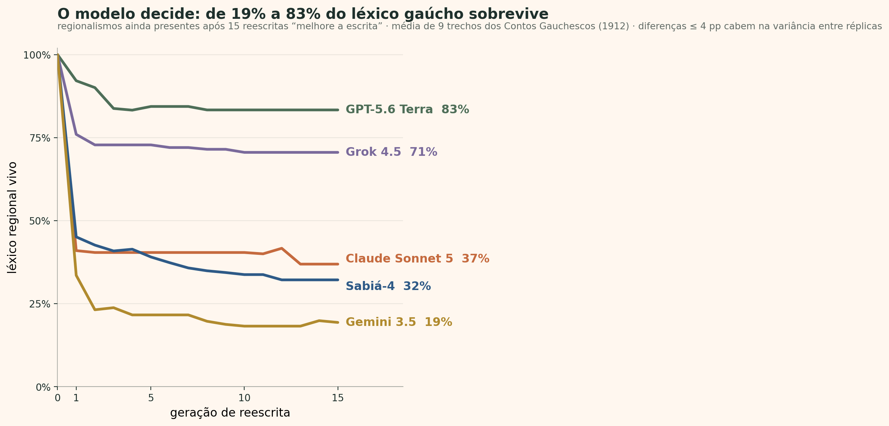

# Ao sul da mediana

**Inteligência artificial generativa e a hipótese da mediocridade cognitiva**

[](https://github.com/tioguerra/ao-sul-da-mediana/actions/workflows/reproduce.yml)
[](LICENSE)
[](LICENSE-CONTENT.md)

Material empírico, bibliográfico e computacional do *position paper* e da apresentação **"Ao sul da mediana: inteligência artificial generativa e a hipótese da mediocridade cognitiva"**, de Rodrigo da Silva Guerra (FURG), preparados para o **Simpósio 31 — IA e gêneros textuais: interfaces pedagógicas ao sul do Equador**, do **XVI Encontro do CELSUL** (Porto Alegre, julho de 2026).

A hipótese em discussão: quando a escrita passa, em escala, por uma mesma infraestrutura generativa, cada texto pode até melhorar, mas o conjunto perde variância, e as caudas da distribuição, onde vivem o raro e a voz de cada um, se despovoam. Essa compressão não ocorre em direção a um centro neutro: os valores expressos pelos modelos, projetados no mapa cultural de Inglehart–Welzel, caem perto dos países de língua inglesa e da Europa protestante (Tao et al., 2024).

> **Estado do trabalho:** pesquisa em desenvolvimento. As sondagens próprias são descritivas, não passaram por revisão por pares e não medem uma “cultura interna” dos modelos.

O repositório documenta **dois experimentos próprios**, com dados brutos, scripts e notas metodológicas:

## Experimento 1 — o mesmo pedido, três cardápios

Em 16 de julho de 2026, quatro modelos de fronteira receberam o mesmo pedido, um cardápio de intervalo para receber dois visitantes estrangeiros na universidade em julho, em formulações diferentes: português coloquial com marcas gaúchas, português formal sem lugar e inglês sem localização. Em português, julho é inverno; em inglês sem lugar, o mesmo julho vira verão. Cada célula abaixo conta quantos modelos (de 4) mencionaram o item:

| Item | português coloquial gaúcho | português formal | inglês, sem lugar |
| --- | :---: | :---: | :---: |
| chimarrão | **4** | 0 | 0 |
| cuca | **4** | 0 | 0 |
| pinhão | 1 | 0 | 0 |
| negrinho | 1 | 0 | 0 |
| brigadeiro | 3 | **4** | 0 |
| pão de queijo | **4** | **4** | 0 |
| hummus | 0 | 3 | **4** |
| wraps | 0 | 0 | 3 |
| frutas de verão | 0 | 0 | **4** |

A bebida-símbolo aparece sempre com o nome rio-grandense, chimarrão, nunca com o "mate" corrente no Uruguai e na Argentina; sob o dialeto gaúcho, um modelo trocou brigadeiro pelo regional negrinho. As exportações brutas das conversas e as notas da sondagem estão em [`artigo/coffee-break/`](artigo/coffee-break/).

## Experimento 2 — gaúchos no mapa de Inglehart–Welzel


Cinco modelos foram submetidos às dez perguntas do Integrated Values Surveys usadas por Tao et al. (2024), com dez formulações do descritor e quatro condições:

1. perguntas em inglês;
2. perguntas em português brasileiro;
3. português com identidade brasileira;
4. português com identidade gaúcha e residência no Rio Grande do Sul.

O desenho produziu 2.000 respostas, das quais 1.989 foram pontuadas. As respostas foram projetadas no mapa de Inglehart–Welzel e comparadas com 107 países, Brasil, Argentina, Uruguai e uma estimativa desagregada do Rio Grande do Sul baseada em 118 casos completos do WVS 2018.

| Modelo | Distância ao Brasil: português → identidade brasileira | Distância ao RS: português → identidade gaúcha |
| --- | ---: | ---: |
| Sabiá-4 | 1,610 → 1,351 (−16,1%) | 1,622 → 2,673 (+64,8%) |
| Claude Sonnet 5 | 1,710 → 0,752 (−56,0%) | 1,218 → 1,492 (+22,5%) |
| GPT-5.6 Terra | 3,135 → 1,651 (−47,3%) | 2,363 → 0,966 (−59,1%) |
| Gemini 3.5 Flash | 2,327 → 1,618 (−30,5%) | 1,827 → 1,402 (−23,3%) |
| Grok 4.5 | 2,448 → 0,663 (−72,9%) | 1,943 → 0,958 (−50,7%) |

O prompt brasileiro aproximou os cinco modelos do Brasil, mas nenhum terminou tendo o Brasil como país geometricamente mais próximo. O prompt gaúcho aproximou três modelos do ponto humano do RS e afastou dois. Nos cinco modelos, ele deslocou as respostas para o polo tradicional do mapa. A decomposição por item indica participação recorrente de orgulho nacional, importância de Deus e respeito pela autoridade.

A leitura completa está em [Resultados e discussão](artigo/mapa-cultural/analise-resultados-distancias-llms.md). A metodologia, os identificadores dos modelos, o parser, a cobertura e as limitações estão na [nota metodológica](artigo/mapa-cultural/nota-metodologica-llms-multicondicao.md).

## Experimento 3 — telefone sem fio: a marca regional some primeiro?



Se um texto com léxico regional passa muitas vezes pela mesma ferramenta generativa, esse léxico se apaga? Nove trechos dos *Contos Gauchescos* de Simões Lopes Neto (1912, domínio público) foram reescritos em cadeia por cinco modelos: cada geração reescreve a anterior, sem ver o original, por 15 gerações. Mede-se quantos regionalismos de uma lista congelada de 90 itens (verificada em dicionários e léxicos gauchescos) sobrevivem a cada passo. O desenho tem controles não regionais coetâneos em português e inglês, três instruções, comprimento fixo, e braços de sensibilidade (grafia de 1912) e de calibração de variância.

A perda depende radicalmente do modelo. Após 15 reescritas com "melhore a escrita", a fração do léxico gaúcho ainda presente (média de 9 trechos):

| Modelo | sobrevivência em G15 |
| --- | ---: |
| GPT-5.6 Terra | 83% |
| Grok 4.5 | 71% |
| Claude Sonnet 5 | 37% |
| Sabiá-4 | 32% |
| Gemini 3.5 | 19% |

A maior queda ocorre já na primeira reescrita. O Sabiá-4, modelo brasileiro, está no grupo que mais apaga, coerente com o Experimento 2: a bandeira no nome não protege o léxico regional. Em três dos cinco modelos, o regional cai mais que palavras comuns de raridade comparável, um efeito cultural além da mera raridade. A instrução decide: a reescrita neutra retém 30% do léxico regional, "melhore a escrita" 48%, e "melhore preservando o vocabulário regional" 82% (atenua, sem anular). Itens sem sinônimo padrão (chimarrão, guaiaca, nhandu) sobrevivem por necessidade referencial; os que têm variante concorrente (china, morocha, cancha) somem primeiro. A variação entre execuções idênticas é de ~3,6 pontos percentuais, muito menor que as diferenças entre modelos.

Delimitação: cadeias de reescrita por inferência modelam o uso repetido da ferramenta, não o retreino de modelos sobre saídas sintéticas; a ponte com o colapso de modelos (Shumailov et al., 2024) é analogia fundamentada. A leitura completa, com todas as figuras, está em [Resultados](artigo/telefone-sem-fio/analise-resultados.md); o desenho pré-registrado, os prompts congelados e as fontes por item estão no [plano experimental](artigo/telefone-sem-fio/plano-experimental.md).

> **Nota sobre linguagem de época:** as sementes e, por consequência, as saídas dos modelos reproduzem o léxico de uma obra de 1912, incluindo termos raciais e étnicos datados (por exemplo no conto "O negro Bonifácio") e o vocabulário gauchesco histórico ("china", "bugre"). As saídas brutas em [`dados/cadeias/`](artigo/telefone-sem-fio/dados/cadeias/) são publicadas sem edição, para fidelidade ao dado; a presença desses termos é do material-fonte, não endosso.

## Estrutura do repositório

```text
.
├── artigo/
│   ├── banco-de-evidencias.md       # revisão dirigida e matriz de evidências
│   ├── referencias-chave.bib        # referências em BibTeX
│   ├── dados-figuras.csv             # números das figuras bibliográficas
│   ├── figuras/                      # quatro figuras de evidências publicadas
│   ├── coffee-break/                 # Experimento 1: conversas brutas e contagens
│   └── mapa-cultural/                # Experimento 2: auditorias, coordenadas, scripts e figuras
├── manuscrito/
│   ├── plano-artigo.md               # estrutura proposta do position paper
│   └── original/resumo-expandido.docx
├── scripts/validate_project.py       # valida integridade, cobertura e segredos
├── Makefile                          # reprodução offline e verificações
└── .github/workflows/reproduce.yml  # integração contínua
```

Um inventário detalhado dos dados está em [Disponibilidade e proveniência](DATA_AVAILABILITY.md). Materiais externos e suas condições são descritos em [Avisos de terceiros](THIRD_PARTY_NOTICES.md).
Os hashes SHA-256 das tabelas, registros e fontes estão em [`CHECKSUMS.sha256`](CHECKSUMS.sha256).

## Reprodução rápida

Requisitos: Python 3.12 e um ambiente virtual.

```bash
python3 -m venv .venv
source .venv/bin/activate
python -m pip install --upgrade pip
python -m pip install -r requirements.txt
make check
```

`make check` compila os scripts, regenera as figuras e tabelas que não exigem rede e valida a estrutura. Nenhuma chamada paga a API é feita.

Alvos úteis:

```bash
make figures             # quatro figuras do banco de evidências
make cultural-maps       # mapas e figuras multicondição
make distances           # distâncias, vizinhos e decomposição por item
make validate            # cobertura dos CSVs, JSONL e varredura de segredos
```

## Repetição das chamadas aos modelos

Os arquivos de auditoria já estão incluídos. Repetir a coleta gera custos, pode atingir versões diferentes dos modelos e exige chaves próprias. As chaves são lidas apenas de variáveis de ambiente e não são gravadas.

```bash
export OPENROUTER_API_KEY="..."
export MARITACA_API_KEY="..."

# Teste mínimo antes de uma coleta extensa
python artigo/mapa-cultural/testar-llms-multicondicao.py \
  --backend openrouter --pilot --limit 1

python artigo/mapa-cultural/testar-llms-multicondicao.py \
  --backend maritaca --pilot --limit 1
```

Leia primeiro a [nota metodológica multicondição](artigo/mapa-cultural/nota-metodologica-llms-multicondicao.md). As rotas, aliases e políticas dos provedores podem ter mudado desde 13 de julho de 2026.

## Dados do WVS

A microbase individual do World Values Survey **não é redistribuída**. O WVS exige registro gratuito e aceite de licença de não redistribuição. Para recalcular o ponto do RS, baixe pessoalmente a versão oficial e execute:

```bash
python artigo/mapa-cultural/gerar-mapa-cultural.py \
  --wvs /caminho/WVS_Cross-National_Wave_7_csv_v6_0.zip
```

Sem esse argumento, o script usa somente as coordenadas agregadas já documentadas no repositório.

## Limitações essenciais

- Dez itens e dois eixos não representam a totalidade de uma cultura.
- Respostas de LLMs são simulações condicionadas, não crenças ou identidades internas.
- O ponto do RS deriva de 118 casos completos de uma pesquisa desenhada para inferência nacional.
- Argentina e Uruguai são médias nacionais, não amostras exclusivas do Pampa.
- As distâncias euclidianas atribuem peso igual aos eixos e não incorporam incerteza amostral.
- Houve uma observação por combinação de prompt; temperatura zero não assegura determinismo.
- Onze respostas do Gemini não foram pontuáveis e foram preservadas sem imputação.

## Autor


**Rodrigo da Silva Guerra** · Universidade Federal do Rio Grande (FURG)

[rodrigoguerra.com](https://rodrigoguerra.com) · [github.com/tioguerra](https://github.com/tioguerra)

Trabalho preparado para o Simpósio 31 do XVI Encontro do CELSUL (Porto Alegre, julho de 2026).

<br clear="left" />

## Como citar

O trabalho foi apresentado como **resumo expandido** no XVI Encontro do CELSUL e está publicado nos anais do evento:

> GUERRA, Rodrigo da Silva. Ao sul da mediana: inteligência artificial generativa e a hipótese da mediocridade cognitiva. In: ENCONTRO DO CÍRCULO DE ESTUDOS LINGUÍSTICOS DO SUL (CELSUL), 16., 2026, Porto Alegre. *Anais eletrônicos* [...]. Porto Alegre: CELSUL, 2026. Resumo expandido, Simpósio 31 (*IA e gêneros textuais: interfaces pedagógicas ao sul do Equador*).

Em BibTeX:

```bibtex
@inproceedings{guerra2026aosuldamediana,
  author    = {Guerra, Rodrigo da Silva},
  title     = {Ao sul da mediana: inteligência artificial generativa e a hipótese da mediocridade cognitiva},
  booktitle = {Anais do XVI Encontro do Círculo de Estudos Linguísticos do Sul (CELSUL)},
  year      = {2026},
  address   = {Porto Alegre},
  publisher = {CELSUL},
  note      = {Resumo expandido. Simpósio 31: IA e gêneros textuais, interfaces pedagógicas ao sul do Equador},
}
```

Para citar os dados e o código deste repositório, use o metadado de [CITATION.cff](CITATION.cff):

> Guerra, Rodrigo da Silva. *Ao sul da mediana: inteligência artificial generativa, alinhamento cultural e a hipótese da mediocridade cognitiva* (repositório de dados e código). Versão 0.1.0, 2026. https://github.com/tioguerra/ao-sul-da-mediana

## Licenças

- Código original: [MIT](LICENSE).
- Texto, figuras e dados derivados originais: [CC BY-NC 4.0](LICENSE-CONTENT.md).
- Materiais de terceiros não são relicenciados: consulte [THIRD_PARTY_NOTICES.md](THIRD_PARTY_NOTICES.md).

## Referência metodológica central

Tao, Y.; Viberg, O.; Baker, R. S.; Kizilcec, R. F. (2024). [Cultural bias and cultural alignment of large language models](https://doi.org/10.1093/pnasnexus/pgae346). *PNAS Nexus*, 3(9), pgae346.
