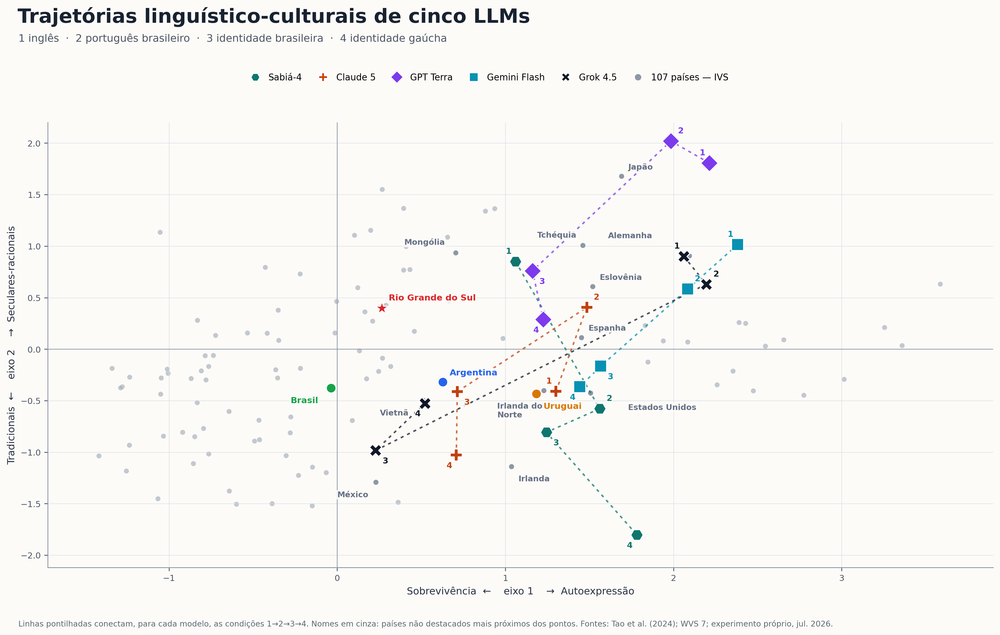

# Ao sul da mediana

**Inteligência artificial generativa, alinhamento cultural e a hipótese da mediocridade cognitiva**

[](https://github.com/tioguerra/ao-sul-da-mediana/actions/workflows/reproduce.yml)
[](LICENSE)
[](LICENSE-CONTENT.md)

Este repositório reúne o material empírico, bibliográfico e computacional de um *position paper* sobre dois efeitos relacionados da IA generativa:

1. o desalinhamento cultural de modelos treinados e alinhados em uma infraestrutura concentrada no Norte Global;
2. a elevação do desempenho médio individual acompanhada por possível compressão da diversidade coletiva.

A hipótese central é que a mediação massiva por uma mesma infraestrutura generativa pode comprimir a variância de textos, ideias e enquadramentos. Essa compressão não ocorre em direção a uma média culturalmente neutra. Ela é atraída por distribuições de treinamento, critérios de alinhamento e convenções linguísticas historicamente situadas.

> **Estado do trabalho:** pesquisa em desenvolvimento. A auditoria própria é descritiva, não passou por revisão por pares e não mede uma “cultura interna” dos modelos.



## Resultado empírico próprio

Cinco modelos foram submetidos às dez perguntas do Integrated Values Surveys usadas por Tao et al. (2024), com dez formulações do descritor e quatro condições:

1. perguntas em inglês;
2. perguntas em português brasileiro;
3. português com identidade brasileira;
4. português com identidade gaúcha e residência no Rio Grande do Sul.

O desenho produziu 2.000 respostas, das quais 1.989 foram pontuadas. As respostas foram projetadas no mapa de Inglehart–Welzel e comparadas com 107 países, Brasil, Argentina, Uruguai e uma estimativa desagregada do Rio Grande do Sul baseada em 118 casos completos do WVS 2018.

| Modelo | Distância ao Brasil: português → identidade brasileira | Distância ao RS: português → identidade gaúcha |
| --- | ---: | ---: |
| Sabiá-4 | 1,610 → 1,351 (−16,1%) | 1,622 → 2,673 (+64,8%) |
| Claude Sonnet 5 | 1,710 → 0,752 (−56,0%) | 1,218 → 1,492 (+22,5%) |
| GPT-5.6 Terra | 3,135 → 1,651 (−47,3%) | 2,363 → 0,966 (−59,1%) |
| Gemini 3.5 Flash | 2,327 → 1,618 (−30,5%) | 1,827 → 1,402 (−23,3%) |
| Grok 4.5 | 2,448 → 0,663 (−72,9%) | 1,943 → 0,958 (−50,7%) |

O prompt brasileiro aproximou os cinco modelos do Brasil, mas nenhum terminou tendo o Brasil como país geometricamente mais próximo. O prompt gaúcho aproximou três modelos do ponto humano do RS e afastou dois. Nos cinco modelos, ele deslocou as respostas para o polo tradicional do mapa. A decomposição por item indica participação recorrente de orgulho nacional, importância de Deus e respeito pela autoridade.

A leitura completa está em [Resultados e discussão](artigo/mapa-cultural/analise-resultados-distancias-llms.md). A metodologia, os identificadores dos modelos, o parser, a cobertura e as limitações estão na [nota metodológica](artigo/mapa-cultural/nota-metodologica-llms-multicondicao.md).

## Estrutura do repositório

```text
.
├── artigo/
│   ├── banco-de-evidencias.md       # revisão dirigida e matriz de evidências
│   ├── referencias-chave.bib        # referências em BibTeX
│   ├── dados-figuras.csv             # números das figuras bibliográficas
│   ├── figuras/                      # quatro figuras de evidências publicadas
│   └── mapa-cultural/                # auditorias, coordenadas, scripts e figuras
├── manuscrito/
│   ├── plano-artigo.md               # estrutura proposta do position paper
│   └── original/resumo-expandido.docx
├── scripts/validate_project.py       # valida integridade, cobertura e segredos
├── Makefile                          # reprodução offline e verificações
└── .github/workflows/reproduce.yml  # integração contínua
```

Um inventário detalhado dos dados está em [Disponibilidade e proveniência](DATA_AVAILABILITY.md). Materiais externos e suas condições são descritos em [Avisos de terceiros](THIRD_PARTY_NOTICES.md).
Os hashes SHA-256 das tabelas, registros e fontes estão em [`CHECKSUMS.sha256`](CHECKSUMS.sha256).

## Reprodução rápida

Requisitos: Python 3.12 e um ambiente virtual.

```bash
python3 -m venv .venv
source .venv/bin/activate
python -m pip install --upgrade pip
python -m pip install -r requirements.txt
make check
```

`make check` compila os scripts, regenera as figuras e tabelas que não exigem rede e valida a estrutura. Nenhuma chamada paga a API é feita.

Alvos úteis:

```bash
make figures             # quatro figuras do banco de evidências
make cultural-maps       # mapas e figuras multicondição
make distances           # distâncias, vizinhos e decomposição por item
make validate            # cobertura dos CSVs, JSONL e varredura de segredos
```

## Repetição das chamadas aos modelos

Os arquivos de auditoria já estão incluídos. Repetir a coleta gera custos, pode atingir versões diferentes dos modelos e exige chaves próprias. As chaves são lidas apenas de variáveis de ambiente e não são gravadas.

```bash
export OPENROUTER_API_KEY="..."
export MARITACA_API_KEY="..."

# Teste mínimo antes de uma coleta extensa
python artigo/mapa-cultural/testar-llms-multicondicao.py \
  --backend openrouter --pilot --limit 1

python artigo/mapa-cultural/testar-llms-multicondicao.py \
  --backend maritaca --pilot --limit 1
```

Leia primeiro a [nota metodológica multicondição](artigo/mapa-cultural/nota-metodologica-llms-multicondicao.md). As rotas, aliases e políticas dos provedores podem ter mudado desde 13 de julho de 2026.

## Dados do WVS

A microbase individual do World Values Survey **não é redistribuída**. O WVS exige registro gratuito e aceite de licença de não redistribuição. Para recalcular o ponto do RS, baixe pessoalmente a versão oficial e execute:

```bash
python artigo/mapa-cultural/gerar-mapa-cultural.py \
  --wvs /caminho/WVS_Cross-National_Wave_7_csv_v6_0.zip
```

Sem esse argumento, o script usa somente as coordenadas agregadas já documentadas no repositório.

## Limitações essenciais

- Dez itens e dois eixos não representam a totalidade de uma cultura.
- Respostas de LLMs são simulações condicionadas, não crenças ou identidades internas.
- O ponto do RS deriva de 118 casos completos de uma pesquisa desenhada para inferência nacional.
- Argentina e Uruguai são médias nacionais, não amostras exclusivas do Pampa.
- As distâncias euclidianas atribuem peso igual aos eixos e não incorporam incerteza amostral.
- Houve uma observação por combinação de prompt; temperatura zero não assegura determinismo.
- Onze respostas do Gemini não foram pontuáveis e foram preservadas sem imputação.

## Como citar

Use o metadado de [CITATION.cff](CITATION.cff). Enquanto o artigo não possui DOI:

> Guerra, Rodrigo da Silva. *Ao sul da mediana: inteligência artificial generativa, alinhamento cultural e a hipótese da mediocridade cognitiva*. Versão 0.1.0, 2026. https://github.com/tioguerra/ao-sul-da-mediana

## Licenças

- Código original: [MIT](LICENSE).
- Texto, figuras e dados derivados originais: [CC BY-NC 4.0](LICENSE-CONTENT.md).
- Materiais de terceiros não são relicenciados: consulte [THIRD_PARTY_NOTICES.md](THIRD_PARTY_NOTICES.md).

## Referência metodológica central

Tao, Y.; Viberg, O.; Baker, R. S.; Kizilcec, R. F. (2024). [Cultural bias and cultural alignment of large language models](https://doi.org/10.1093/pnasnexus/pgae346). *PNAS Nexus*, 3(9), pgae346.
