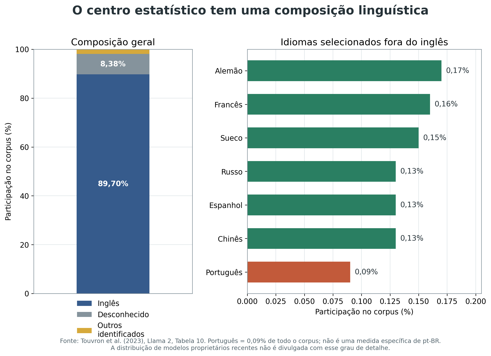
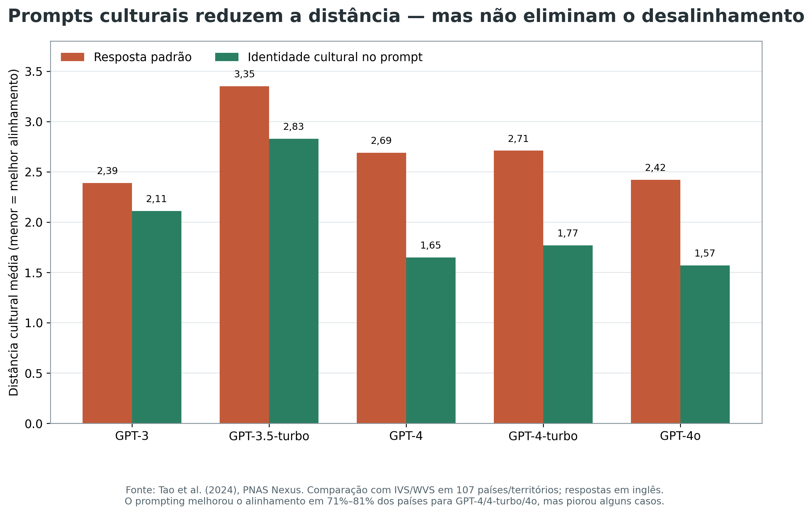
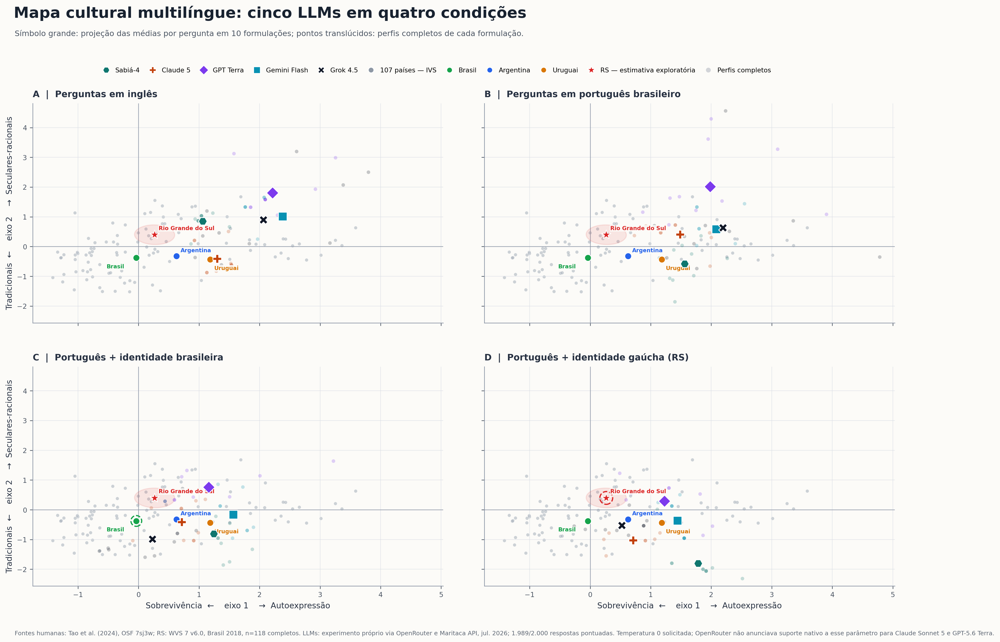
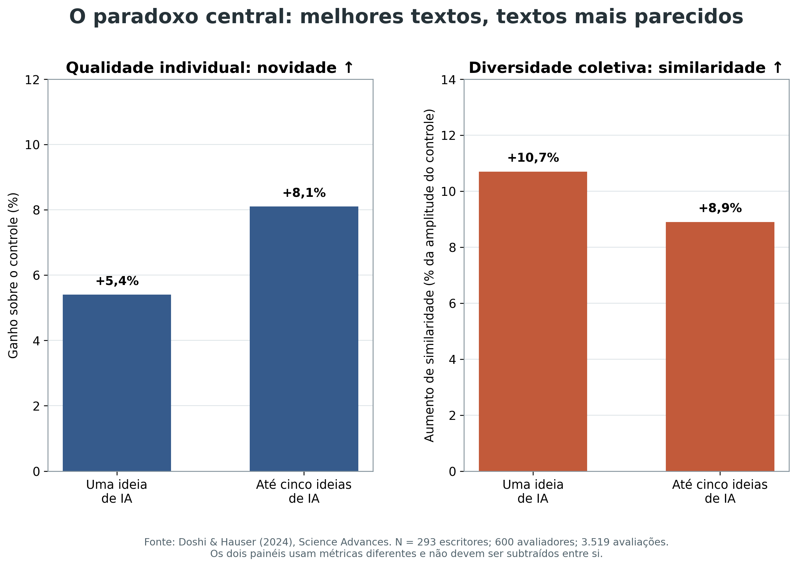
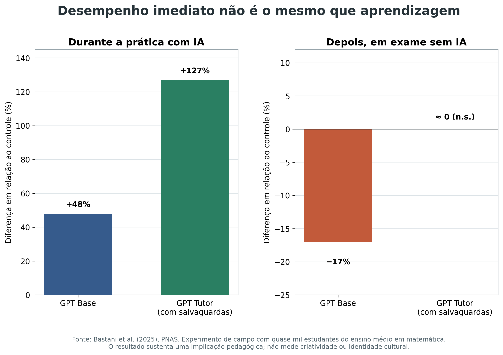

# Banco de evidências para o position paper

## *Ao sul da mediana: inteligência artificial generativa e a hipótese da mediocridade cognitiva*

**Status:** levantamento inicial dirigido, concluído em 13 de julho de 2026  
**Escopo:** mecanismo probabilístico, viés cultural/colonialismo digital, criatividade e homogeneização, escala de adoção, aprendizagem e contraprovas  
**Nota metodológica:** este documento não é uma revisão sistemática. Foram priorizados artigos revisados por pares, experimentos controlados, estudos de campo e auditorias com dados públicos. Preprints e inferências teóricas estão identificados como tais.

---

## 1. Resultado editorial: a tese fica mais forte se “mediocridade” significar compressão assimétrica da variância

A formulação empiricamente mais defensável não é que a IA necessariamente piora cada texto. Há evidência robusta de que, em várias tarefas, ela **eleva a qualidade média**, reduz o tempo de execução e beneficia mais os participantes inicialmente menos proficientes. O problema aparece em outra dimensão: diferentes pessoas passam a produzir resultados **mais semelhantes entre si**.

Isso permite formular a hipótese central assim:

> Quando uma mesma infraestrutura generativa medeia, em escala, atos de escrita, síntese e decisão, ela pode elevar o desempenho médio individual ao mesmo tempo que comprime a variância do repertório coletivo. Como o centro estatístico dessa infraestrutura é culturalmente situado, a compressão é assimétrica: sujeitos periféricos são atraídos não para uma média universal, mas para uma média produzida por corpora, instituições e critérios de alinhamento dominantes.

Essa formulação une as duas frentes do resumo:

1. **A mediana tem geografia.** Dados, infraestrutura, idiomas e pessoas que fornecem feedback não estão distribuídos uniformemente.
2. **A mediação comprime a distribuição.** Ganhos individuais podem coexistir com menor diversidade entre textos, ideias, estilos e soluções.
3. **O efeito pode ser cumulativo.** Textos mediados por IA entram na circulação social e, potencialmente, nos dados de treinamento futuros.

Uma denominação técnica útil dentro do artigo seria **“hipótese da compressão culturalmente assimétrica da variância”**. “Mediocridade cognitiva” pode permanecer no título como formulação provocativa, desde que seja definida como perda de caudas, de desvio e de pluralidade — e não simplesmente como queda da nota média.

### Quatro proposições testáveis

- **P1 — nivelamento:** a assistência por IA melhora mais o desempenho de participantes abaixo da média do que o de participantes acima da média.
- **P2 — homogeneização:** a assistência por uma mesma IA aumenta a similaridade semântica, lexical ou estilística entre produtos de pessoas diferentes.
- **P3 — assimetria cultural:** a convergência é maior para grupos culturalmente mais distantes do centro representado pelo modelo.
- **P4 — contingência de projeto:** prompting cultural, personas diversas, dados locais e salvaguardas pedagógicas reduzem parte do efeito; portanto, a homogeneização é uma tendência sociotécnica, não um destino matemático inevitável.

---

## 2. Correção técnica indispensável: a função de perda não “premia a mediana” literalmente

Modelos de linguagem autoregressivos são treinados, em termos simplificados, para aumentar a probabilidade do próximo token observado. A perda de entropia cruzada penaliza previsões que atribuem baixa probabilidade ao token correto; ela não calcula nem busca uma “resposta mediana”. A concentração em modos de alta probabilidade emerge da combinação de:

- distribuição e repetição dos dados de treinamento;
- objetivo de previsão do próximo token;
- ajuste por instruções e preferências humanas;
- filtros de segurança;
- estratégia de decodificação, temperatura e seleção de amostras;
- repetição do mesmo sistema por milhões de usuários.

O estudo mais apropriado para sustentar o mecanismo é [McCoy et al. (2024)](https://www.pnas.org/doi/10.1073/pnas.2322420121). Em 11 tarefas com GPT-3.5 e GPT-4, os autores mostraram que a acurácia varia com a probabilidade da tarefa, da entrada e da saída mesmo quando a tarefa é determinística. No exemplo mais expressivo, o GPT-4 decodificou uma cifra simples com **51% de acurácia quando a saída era uma sequência de alta probabilidade**, mas apenas **13% quando a saída era de baixa probabilidade**.

**O que o resultado autoriza dizer:** situações e saídas raras impõem dificuldades sistemáticas a modelos moldados pela predição probabilística.  
**O que não autoriza dizer:** toda ideia rara é rejeitada, toda saída provável é medíocre ou o treinamento minimiza distância em relação a uma mediana literal.

Sugestão de redação para a seção técnica:

> “Mediana” é usada aqui como metáfora sociotécnica para a atração exercida por modos de alta probabilidade. A função de perda não calcula uma resposta mediana; a tendência concentradora emerge da distribuição dos dados, do objetivo autoregressivo, do alinhamento e da decodificação.

---

## 3. Frente 1 — viés cultural, deslocamento da voz e colonialismo digital

### 3.1 O corpus não é neutro — e os modelos recentes são opacos

Uma afirmação segura deve se apoiar em corpora cuja composição foi divulgada. No [relatório técnico do Llama 2](https://arxiv.org/abs/2307.09288), **89,70%** do corpus foi classificado como inglês e **0,09%** como português — todas as variedades de português, não especificamente pt-BR. A diferença é de aproximadamente **997 para 1**. Não é seguro transportar essa proporção para GPT-4, Claude, Gemini ou modelos proprietários atuais, porque as empresas não divulgam dados equivalentes.

O [AI Index 2026, de Stanford](https://hai.stanford.edu/ai-index/2026-ai-index-report/research-and-development), ajuda a sustentar a concentração institucional: a indústria produziu **mais de 90% dos modelos de IA considerados notáveis em 2025**; os Estados Unidos produziram **59**, e a China, **35**. O relatório também registra queda na transparência sobre código de treinamento, tamanho dos datasets e duração do treinamento nos sistemas mais intensivos em recursos.

**Uso argumentativo:** o centro probabilístico não é uma amostra neutra da humanidade; sua composição linguística e institucional é concentrada.  
**Cuidado:** idioma não equivale automaticamente a cultura, e volume de tokens não mede sozinho a qualidade da representação.

### 3.2 O “humano médio” do modelo se parece com países ocidentais

[Tao et al. (2024)](https://academic.oup.com/pnasnexus/article/3/9/pgae346/7756548) compararam respostas de cinco versões de GPT com o Integrated Values Surveys/World Values Survey em **107 países e territórios**. Foram usadas dez perguntas que compõem o mapa cultural de Inglehart–Welzel e dez variações de prompt.

Resultados centrais:

- As respostas-padrão de todos os modelos se aproximaram de valores de países anglófonos e da Europa protestante.
- Nos modelos mais recentes do estudo, inserir uma identidade nacional no prompt reduziu a distância cultural média:
  - GPT-4o: **2,42 → 1,57**;
  - GPT-4-turbo: **2,71 → 1,77**;
  - GPT-4: **2,69 → 1,65**.
- A intervenção melhorou o alinhamento em **71,0%** dos países para GPT-4o, **81,3%** para GPT-4-turbo e **77,6%** para GPT-4. Logo, falhou ou piorou entre aproximadamente um quinto e quase um terço dos casos.
- No GPT-4o, por exemplo, a distância da Jordânia caiu de **4,10 para 0,36**, enquanto a da Finlândia aumentou de **0,20 para 2,43**. Isso mostra que prompting cultural ajuda, mas não é uma correção universal.

**Uso argumentativo:** existe evidência quantitativa de que a resposta “neutra” do modelo não é culturalmente neutra.  
**Limitação:** o estudo usa perguntas de valores nacionais, respostas em inglês e modelos de 2020–2024; não mede diretamente voz literária, Pampa ou variedades do português.

#### Extensão exploratória ao Rio Grande do Sul

A documentação do WVS 7 identifica explicitamente o estado por `N_REGION_ISO=76021` (`BR-RS`). Aplicando a transformação de Tao et al. à coleta brasileira de 2018, 118 dos 151 entrevistados do estado apresentaram dados completos nos dez itens. O ponto exploratório do RS foi **(0,266; 0,398)**, nos eixos sobrevivência–autoexpressão e tradicional–secular-racional. Para comparação, as médias nacionais usadas no artigo são: Brasil **(−0,037; −0,376)**, Argentina **(0,628; −0,320)** e Uruguai **(1,184; −0,434)**.

O bootstrap simples de respondentes produziu intervalos percentis de 95% de **[0,007; 0,536]** no primeiro eixo e **[0,137; 0,663]** no segundo. Uma análise ponderada de sensibilidade resultou em **(0,289; 0,424)**. A diferença em relação ao Brasil é sugestiva, mas não autoriza inferência estadual: a amostra foi desenhada para representatividade nacional, restaram apenas 118 casos completos, e o ponto do RS usa uma única coleta enquanto os pontos nacionais agregam país-ano das ondas 5–7.

O segundo painel acrescenta uma observação diretamente útil à tese. Quando o GPT-4o foi instruído a responder como pessoa típica do país, as distâncias remanescentes foram **1,74 para a Argentina**, **2,11 para o Brasil** e **1,72 para o Uruguai**. O estudo não incluiu identidade subnacional gaúcha; portanto, um ponto de “GPT gaúcho” exigiria experimento novo. A [nota metodológica](mapa-cultural/nota-metodologica.md) reúne coordenadas, código, limitações e legenda pronta para o artigo.

#### Teste exploratório do Sabiá-4 em português

Em 13 de julho de 2026, repetimos a parte de expressão cultural padrão do protocolo de Tao et al. com o modelo brasileiro **Sabiá-4**, via Maritaca API. As dez perguntas e os dez descritores genéricos foram traduzidos para português; não foi indicada nacionalidade ou região, a temperatura foi zero e cada combinação foi consultada separadamente. As **100 respostas** puderam ser pontuadas.

O ponto médio do Sabiá-4 foi **(1,561; −0,578)**. Entre os 107 pontos humanos, os mais próximos foram Estados Unidos (**d=0,163**), Irlanda do Norte (**0,376**) e Uruguai (**0,404**). As distâncias para Argentina, Brasil e Rio Grande do Sul foram, respectivamente, **0,968**, **1,610** e **1,622**. Portanto, neste instrumento, a origem brasileira do modelo e sua especialização em português não produziram coincidência automática com a média nacional brasileira nem com a estimativa regional gaúcha.

A posição foi sensível à paráfrase mesmo com temperatura zero: o desvio-padrão descritivo entre os dez pontos foi **0,323** no eixo sobrevivência–autoexpressão e **0,666** no eixo tradicional–secular-racional. Essa dispersão não é incerteza amostral, pois as formulações não constituem amostra aleatória. A [nota específica do experimento](mapa-cultural/nota-metodologica-maritaca-sabia4.md) documenta prompts, conversões, respostas brutas, uso da API e limitações.

**Uso argumentativo:** um modelo nacional ou especializado no idioma local ainda pode expressar, por padrão, uma combinação de valores distante da população que se imagina representar.  
**Limitação:** a comparação com os GPTs também muda idioma, data e fornecedor; o português é, por si só, uma pista contextual. O ponto mede uma resposta situada ao protocolo, não uma identidade cultural intrínseca do Sabiá-4.

#### Auditoria multilíngue e prompting cultural em cinco modelos atuais

Para separar idioma de identidade solicitada, ampliamos o piloto para **Sabiá-4, Claude Sonnet 5, GPT-5.6 Terra, Gemini 3.5 Flash e Grok 4.5** em quatro condições: inglês, português brasileiro, português com identidade brasileira e português com identidade gaúcha. O desenho produziu **2.000 respostas observadas** em 13 de julho de 2026; 1.989 foram pontuadas e onze saídas do Gemini foram preservadas como não pontuáveis.

A comparação mais informativa mantém o idioma em português e altera apenas a identidade solicitada:

| Modelo | Distância ao Brasil: padrão → identidade brasileira | Distância ao RS: padrão → identidade gaúcha |
| --- | ---: | ---: |
| Sabiá-4 | 1,610 → 1,351 (**−16,1%**) | 1,622 → 2,673 (**+64,8%**) |
| Claude Sonnet 5 | 1,710 → 0,752 (**−56,0%**) | 1,218 → 1,492 (**+22,5%**) |
| GPT-5.6 Terra | 3,135 → 1,651 (**−47,3%**) | 2,363 → 0,966 (**−59,1%**) |
| Gemini 3.5 Flash | 2,327 → 1,618 (**−30,5%**) | 1,827 → 1,402 (**−23,3%**) |
| Grok 4.5 | 2,448 → 0,663 (**−72,9%**) | 1,943 → 0,958 (**−50,7%**) |

O prompt brasileiro aproximou os cinco modelos da média humana do Brasil, embora nenhum tenha coincidido com ela. O prompt gaúcho, porém, aproximou apenas Terra, Gemini e Grok: Sabiá e Claude se afastaram do ponto humano do RS. O Sabiá chegou a **(1,782; −1,803)**, muito abaixo do RS **(0,266; 0,398)** no eixo tradicional–secular-racional. Essa inversão é compatível com a hipótese de ativação de um estereótipo regional: dizer ao modelo para “ser gaúcho” não garante representar os respondentes gaúchos observados.

O idioma sozinho também foi uma intervenção forte e não uniforme. A distância entre o ponto em inglês e o ponto em português variou de **0,301** no Grok a **1,513** no Sabiá, com direções distintas entre modelos. Logo, tratar a resposta em português como equivalente a uma voz brasileira mistura dois efeitos empiricamente separáveis.

**Uso argumentativo:** prompting cultural é uma intervenção real, mas não uma tecnologia confiável de representação; pode aproximar, não alterar ou afastar o modelo do grupo humano nomeado.  
**Limitação:** trata-se de experimento exploratório próprio, não revisado por pares. O instrumento contém dez itens, os aliases de API podem mudar, e o ponto do RS deriva de uma subamostra pequena. A [nota metodológica completa](mapa-cultural/nota-metodologica-llms-multicondicao.md) documenta modelos, prompts, parser, recusas, custos, coordenadas e arquivos de reprodução. A [análise de resultados](mapa-cultural/analise-resultados-distancias-llms.md) calcula os vizinhos entre os 107 países, decompõe os deslocamentos por item e discute a analogia com os casos de piora observados por Tao et al.

### 3.3 O deslocamento cultural aparece durante a escrita, em pequenas sugestões

O experimento controlado de [Agarwal, Naaman e Vashistha (2025)](https://arxiv.org/html/2409.11360v3), publicado na CHI, é o melhor exemplo prático para a premissa do artigo. **118 participantes da Índia e dos Estados Unidos** realizaram quatro tarefas culturalmente ancoradas com e sem autocomplete do GPT-4o.

Resultados relevantes:

- A similaridade cosseno média entre textos indianos e estadunidenses subiu de aproximadamente **0,48 sem IA para 0,54 com IA**; a diferença foi estatisticamente significativa.
- A direção foi assimétrica: os textos de participantes indianos se aproximaram mais do estilo estadunidense do que o inverso.
- Entre sugestões iniciais, a comida oferecida era sempre **pizza ou sushi**, e o festival, sempre **Natal**.
- Nenhuma primeira sugestão de celebridade coincidiu com a personalidade indiana que o participante pretendia mencionar; as sugestões eram quase sempre ocidentais.
- Entre participantes indianos, figuras públicas indianas apareceram em **54%** dos textos sem IA e em **44%** dos textos com IA. Os próprios autores alertam que esses subconjuntos são pequenos e não permitem uma conclusão causal forte sobre mudança de preferência.

Este estudo ancora precisamente a ideia das “pequenas alterações massivas”: o mecanismo não precisa censurar uma cultura. Basta oferecer continuamente a palavra, o exemplo ou o enquadramento mais disponível no repertório do modelo.

### 3.4 Variedades linguísticas podem mudar decisões, não apenas estilo

[Hofmann et al. (2024)](https://www.nature.com/articles/s41586-024-07856-5), em *Nature*, mostraram preconceito encoberto contra falantes de African American English (AAE). Modelos atribuíram estereótipos mais negativos a falantes identificados apenas por marcas dialetais e foram mais propensos a recomendar empregos de menor prestígio, condenações criminais e pena de morte. O alinhamento por preferência humana reduziu manifestações explícitas de racismo, mas não eliminou o preconceito dialetal encoberto e, em alguns casos, aumentou a distância entre os dois.

**Uso argumentativo:** traços linguísticos podem alterar avaliações consequenciais mesmo sem menção explícita a raça ou origem.  
**Limitação:** AAE não é uma evidência direta sobre português gaúcho, portunhol fronteiriço ou espanhol platino. Deve ser apresentado como prova de conceito e justificativa para uma auditoria local.

### 3.5 Quem alinha o modelo também importa

O [PRISM Alignment Project](https://arxiv.org/abs/2404.16019), apresentado na NeurIPS 2024, reuniu **1.500 participantes nascidos em 75 países**, **8.011 conversas** e **21 modelos**. Seu valor para o artigo é menos uma direção numérica única e mais uma demonstração metodológica: preferências sobre respostas variam entre pessoas e culturas; portanto, “alinhamento humano” depende de **quais humanos** fornecem avaliações e de como suas diferenças são agregadas.

### 3.6 Enquadramento de colonialismo digital

Os resultados empíricos ganham interpretação política com quatro referências teóricas:

- [Kwet (2019)](https://journals.sagepub.com/doi/10.1177/0306396818823172): colonialismo digital como controle de arquitetura, infraestrutura e ecossistemas por empresas estadunidenses.
- [Couldry e Mejias (2019)](https://journals.sagepub.com/doi/10.1177/1527476418796632): colonialismo de dados como apropriação da vida social convertida em fluxo de dados.
- [Ricaurte (2019)](https://journals.sagepub.com/doi/10.1177/1527476419831640): epistemologias de dados, colonialidade do poder e possibilidades de resistência.
- [Mohamed, Png e Isaac (2020)](https://link.springer.com/article/10.1007/s13347-020-00405-8): IA decolonial como antecipação sociotécnica e recuperação de perspectivas marginalizadas.

O argumento fica mais rigoroso se “colonialismo digital” não for usado como sinônimo de qualquer viés. A cadeia causal proposta deve ser explícita:

**concentração de infraestrutura e dados → representação desigual → alinhamento por grupos limitados → padrões culturais nas saídas → adoção massiva em instituições → deslocamento cumulativo da linguagem e dos enquadramentos.**

### 3.7 Respostas locais mostram que o problema é modificável

O artigo deve incluir iniciativas do Sul não como nota otimista, mas como contraprova à inevitabilidade. [Corrêa et al. (2025)](https://www.sciencedirect.com/science/article/pii/S2666389925001734) apresentaram o **GigaVerbo, corpus aberto de 200 bilhões de tokens em português**, e a família **Tucano**, treinada nativamente em português. Os modelos superaram modelos portugueses e multilíngues comparáveis em diversos benchmarks.

O [Sabiá-2](https://arxiv.org/abs/2403.09887), especializado em português, igualou ou superou o GPT-4 em **23 de 64 exames** e superou o GPT-3.5 em **58 de 64** no estudo dos autores. Esses resultados sustentam que especialização linguística pode alterar desempenho sem mero aumento de escala.

**Interpretação:** treinar localmente pode corrigir parte da assimetria de corpus e tokenização. Não resolve sozinho a concentração dentro do próprio português, a seleção de valores no alinhamento nem a tendência de muitos usuários receberem as mesmas sugestões.

---

## 4. Frente 2 — criatividade, nivelamento e homogeneização

### 4.1 O experimento-âncora: qualidade individual sobe, diversidade coletiva cai

[Doshi e Hauser (2024)](https://www.science.org/doi/10.1126/sciadv.adn5290) conduziram um experimento com **293 escritores**, cujas histórias foram avaliadas por **600 pessoas**, totalizando **3.519 avaliações**. Os participantes escreveram sem IA, com uma ideia gerada por IA ou com até cinco ideias.

Resultados:

- Com uma ideia de IA, a novidade média aumentou **5,4%**; com até cinco, **8,1%**.
- Os maiores ganhos concentraram-se em participantes com menor criatividade inicial. Para esse grupo, até cinco ideias aumentaram a novidade em **10,7%**, a utilidade em **11,5%**, a qualidade da escrita em **26,6%** e o prazer da leitura em **22,6%**.
- Entre os participantes inicialmente mais criativos, os ganhos foram pequenos ou inexistentes.
- Ao mesmo tempo, as histórias ficaram mais parecidas entre si. O aumento de similaridade correspondeu a **10,7% da amplitude de similaridade do controle** na condição de uma ideia e a **8,9%** na condição de até cinco ideias.

Esse resultado deve ser o centro empírico do position paper. Ele evita uma tese tecnofóbica simplista: a IA pode democratizar um patamar de qualidade e, simultaneamente, reduzir a pluralidade do conjunto.

### 4.2 O efeito aparece em escrita argumentativa e em escala coletiva

[Padmakumar e He (2024)](https://arxiv.org/abs/2309.05196), em experimento controlado de coescrita de ensaios argumentativos, compararam escrita sem IA, com GPT-3 base e com InstructGPT. A colaboração com **InstructGPT**, mas não com o modelo base, aumentou significativamente a similaridade entre autores e reduziu diversidade lexical e de conteúdo. A perda foi atribuída ao texto contribuído pelo modelo; o texto produzido diretamente pelos usuários não perdeu diversidade. Isso sugere que o pós-treinamento que torna o sistema mais obediente e útil pode também concentrar suas formulações.

[Moon, Green e Kushlev (2025)](https://www.sciencedirect.com/science/article/pii/S294988212500091X) analisaram **2.200 redações de admissão universitária em três estudos pré-registrados**. Cada redação humana adicional acrescentou mais ideias novas ao conjunto do que cada redação do GPT-4; a diferença cresceu com o tamanho do corpus e persistiu após alterações de prompt e parâmetros. A contribuição conceitual é a **taxa de crescimento da diversidade**: não basta perguntar se um texto isolado parece criativo; é preciso medir quanto território novo ele adiciona quando milhares de textos são reunidos.

### 4.3 O nivelamento para cima é real e deve entrar como contraponto

Em um estudo de campo com [5.172 agentes de atendimento](https://academic.oup.com/qje/article/140/2/889/7990658), Brynjolfsson, Li e Raymond (2025) encontraram aumento médio de produtividade de **15%**, chegando a **30%** entre trabalhadores menos experientes ou menos qualificados. Os mais experientes tiveram ganhos pequenos, e a qualidade de suas conversas apresentou ligeira queda. O texto dos agentes menos qualificados passou a se aproximar do padrão dos melhores agentes.

Esse é um caso forte de **compressão de distribuição com benefício social concreto**. O paper deve reconhecer que padronização pode significar transferência de boas práticas, fluência e acesso. O problema normativo surge quando o sistema também reduz contribuições originais dos melhores trabalhadores ou exporta um padrão cultural como se fosse universal.

### 4.4 A homogeneização não é inevitável

O preprint de [Wan e Kalman (2025)](https://arxiv.org/abs/2504.13868) modificou o desenho de Doshi e Hauser usando dez personas de IA com origens culturais, estilos de pensamento e preferências de gênero diferentes. Ideias dentro de uma mesma persona eram muito semelhantes (**similaridade média 0,92**), mas ideias entre personas eram bastante distintas (**0,20**). As histórias humanas apoiadas nesse conjunto mantiveram diversidade coletiva equivalente à condição sem IA.

Por ser preprint, o resultado deve ser apresentado com cautela. Ainda assim, ele é teoricamente importante: **a diversidade do sistema de sugestões é uma variável de projeto**. Isso desloca a conclusão de “LLMs inevitavelmente homogeneízam” para “interfaces padrão, com uma voz padrão, tendem a homogeneizar”.

---

## 5. Escala, aprendizagem e ciclos de realimentação

### 5.1 A mediação já é grande o suficiente para importar socialmente

[Kobak et al. (2025)](https://www.science.org/doi/10.1126/sciadv.adt3813) analisaram mais de **15 milhões de resumos do PubMed, de 2010 a 2024**. Mudanças abruptas de vocabulário sugerem que pelo menos **13,5% dos resumos de 2024** foram processados por LLMs, com estimativas de até **40% em alguns subcorpora**.

[Liang et al. (2025)](https://www.nature.com/articles/s41562-025-02273-8) analisaram **1.121.912 artigos e preprints**, de janeiro de 2020 a setembro de 2024. A estimativa de conteúdo modificado por LLM chegou a **até 22% em ciência da computação** e a **até 9% em matemática e no portfólio Nature**.

Esses estudos não provam perda de diversidade. Sua função é demonstrar o multiplicador de escala: mesmo efeitos pequenos por texto podem aparecer em uma fração relevante da produção científica.

### 5.2 Desempenho com a ferramenta não é aprendizagem sem a ferramenta

[Bastani et al. (2025)](https://www.pnas.org/doi/10.1073/pnas.2422633122) realizaram experimento de campo com quase mil estudantes do ensino médio em matemática. Durante a prática, a interface semelhante ao ChatGPT (“GPT Base”) elevou as notas em **48%**, e o tutor com salvaguardas pedagógicas (“GPT Tutor”), em **127%**. Quando a IA foi retirada no exame, o grupo GPT Base ficou **17% abaixo do controle**; o GPT Tutor ficou estatisticamente indistinguível do controle.

Esse estudo é mais sólido que alegações genéricas sobre “atrofia cerebral”. Ele mostra, causalmente, que uma interface sem salvaguardas pode melhorar a execução e prejudicar a aquisição de habilidade, enquanto outra arquitetura preserva a aprendizagem. Não mede criatividade nem identidade cultural, mas sustenta a seção pedagógica e a defesa da fricção cognitiva.

### 5.3 Evidência de “dívida cognitiva” ainda é preliminar

O estudo de EEG de [Kosmyna et al. (2025)](https://arxiv.org/abs/2506.08872) deve aparecer, no máximo, como evidência exploratória: teve 54 participantes nas primeiras sessões e 18 na sessão de troca de condições, não havia passado por revisão por pares na versão consultada e recebeu críticas metodológicas sobre amostra, reprodutibilidade e análise de EEG. Não convém usá-lo como pilar.

Mais seguro é falar em **terceirização cognitiva sob condições específicas**, amparada pelo resultado causal de Bastani e por pesquisas de autorrelato sobre redução de esforço crítico — sempre distinguindo redução de esforço de dano cerebral ou declínio cognitivo permanente.

### 5.4 Model collapse é mecanismo técnico e analogia limitada

[Shumailov et al. (2024)](https://www.nature.com/articles/s41586-024-07566-y) mostraram que treinar sucessivas gerações de modelos com dados gerados por modelos anteriores pode causar colapso. Os eventos de baixa probabilidade desaparecem primeiro; depois, o suporte da distribuição encolhe e pode convergir para poucos modos.

**Uso legítimo no artigo:** explicar um possível ciclo técnico de realimentação quando conteúdo sintético passa a compor dados futuros.  
**Uso ilegítimo:** afirmar que o estudo prova “colapso da cognição humana”. A passagem do fenômeno técnico para o fenômeno social é uma hipótese do position paper e precisa ser marcada como inferência.

---

## 6. Matriz de evidências e força inferencial

| Alegação do artigo | Melhor evidência | Resultado quantitativo | Força e limite |
| --- | --- | --- | --- |
| Saídas improváveis são mais difíceis | McCoy et al. 2024, PNAS | Cifra: 51% em saída provável vs. 13% em saída improvável | Direta para sensibilidade à probabilidade; não mede cultura ou criatividade |
| O corpus tem centro linguístico | Llama 2, Touvron et al. 2023 | 89,70% inglês; 0,09% português | Dado primário de um corpus divulgado; não generalizar a modelos fechados atuais |
| O padrão cultural não é neutro | Tao et al. 2024, PNAS Nexus | 107 países; respostas próximas de culturas anglófonas/protestantes | Auditoria forte; cultura nacional e prompts em inglês são aproximações |
| Prompt cultural não garante representação local | Experimento exploratório próprio, 2026 | 2.000 respostas; identidade brasileira aproximou 5/5 modelos, identidade gaúcha aproximou 3/5 | Evidência piloto diretamente local; não revisada por pares, dez itens e RS com n=118 completos |
| Sugestões podem deslocar escrita de grupos periféricos | Agarwal et al. 2025, CHI | N=118; similaridade Índia–EUA 0,48→0,54 | Experimento diretamente relevante; apenas Índia/EUA e quatro tarefas |
| Dialeto pode mudar decisões | Hofmann et al. 2024, Nature | Empregos, condenação e pena de morte mais negativos para AAE | Evidência consequencial robusta; extrapolação ao Pampa exige estudo local |
| IA melhora indivíduo e homogeneíza o coletivo | Doshi & Hauser 2024, Science Advances | Novidade +8,1%; similaridade +8,9% da amplitude, na condição de cinco ideias | Experimento-âncora; histórias curtas e modelo específico |
| Alinhamento pode reduzir diversidade | Padmakumar & He 2024, ICLR | Queda significativa com InstructGPT, não com GPT-3 base | Sustenta o papel do pós-treinamento; domínio argumentativo limitado |
| O problema cresce com o tamanho do corpus | Moon et al. 2025 | 2.200 redações; humanos adicionam mais ideias por novo texto | Três estudos pré-registrados; redações humanas precedem a era ChatGPT |
| IA nivela desempenho para cima | Brynjolfsson et al. 2025, QJE | +15% médio; +30% para menos experientes/qualificados | Campo real e grande N; uma empresa e uma tarefa |
| Dependência sem salvaguarda pode prejudicar aprendizagem | Bastani et al. 2025, PNAS | Prática +48%; exame sem IA −17% | Experimento causal forte; matemática escolar, não escrita cultural |
| A mediação já ocorre em escala | Kobak et al. 2025; Liang et al. 2025 | 13,5% de abstracts PubMed; até 22% em CS | Mede prevalência por traços linguísticos; não mede diretamente diversidade |
| Realimentação sintética perde caudas | Shumailov et al. 2024, Nature | Eventos raros desaparecem primeiro | Mecanismo técnico; analogia social deve ser explicitada |
| Projeto diverso pode mitigar homogeneização | Wan & Kalman 2025 | Similaridade 0,92 dentro de persona; 0,20 entre personas | Contraprova útil, mas ainda preprint |

---

## 7. Estrutura revisada do artigo

| Seção | Função | Evidências principais | Proporção sugerida |
| --- | --- | --- | --- |
| 1. Ao sul da mediana | Problema, lugar de enunciação e tese | Uma vinheta de autocomplete + formulação da compressão assimétrica | 8% |
| 2. Da probabilidade ao “centro” | Explicar mecanismo sem antropomorfismo | McCoy; objetivo autoregressivo; alinhamento e decodificação | 11% |
| 3. A mediana tem geografia | Mostrar concentração linguística e institucional | Llama 2; AI Index; Kwet; Couldry & Mejias; Ricaurte | 14% |
| 4. Quando o centro escreve conosco | Demonstrar deslocamento cultural em interação | Tao; Agarwal; Hofmann; PRISM | 18% |
| 5. O paradoxo da elevação homogênea | Núcleo criatividade/variância | Doshi & Hauser; Padmakumar & He; Moon; Brynjolfsson | 20% |
| 6. Da frase ao ecossistema | Escala, aprendizagem e realimentação | Kobak; Liang; Bastani; Shumailov | 12% |
| 7. A tendência não é destino | Contrapontos, soluções e limites | Wan & Kalman; Tucano; Sabiá; prompting cultural | 8% |
| 8. Escrever desde o Pampa | Implicações pedagógicas e agenda empírica local | Protocolo de auditoria abaixo | 6% |
| 9. Conclusão | Retomar voz, desvio e soberania | Síntese | 3% |

### Ordem de redação recomendada

1. Seção 5 — porque contém o achado-âncora e define o que “mediocridade” significa.
2. Seção 4 — porque fornece o elo prático entre modelo e escritor.
3. Seções 2 e 3 — mecanismo e geografia do centro.
4. Seção 6 — escala e ciclo.
5. Seções 7 e 8 — contraprovas, desenho e pedagogia.
6. Introdução e conclusão por último.

---

## 8. Proposta de estudo-piloto do Pampa

Há uma lacuna real: o levantamento não encontrou experimento equivalente ao de Agarwal et al. para o Pampa, português gaúcho ou escrita fronteiriça. Essa ausência pode se tornar contribuição original do artigo, ainda que o position paper apresente apenas o protocolo.

### Versão mínima, executável sem recrutar participantes para escrever

**Desenho:** 12 tarefas × 3 modelos × 3 condições × 10 repetições = **1.080 saídas**.

**Modelos:** um modelo proprietário de fronteira, um modelo multilíngue aberto e um modelo especializado em português. Registrar versão, data, temperatura e parâmetros, porque os serviços mudam.

**Condições:**

1. prompt genérico;
2. prompt que solicita perspectiva cultural do Pampa;
3. prompt com pequeno conjunto de textos/referências locais ou recuperação de corpus local.

**Tarefas possíveis:**

- redigir memorando de política pública sobre seca, enchente ou uso do território;
- resumir conflito entre produtividade rural, conservação e modos de vida locais;
- escrever mensagem institucional para comunidade fronteiriça bilíngue;
- recomendar prioridades para uma cooperativa ou escola regional;
- reescrever um depoimento preservando marcas de oralidade sem caricaturá-las;
- produzir personagens, exemplos e metáforas para explicar um conceito científico.

As tarefas precisam representar mais de um Pampa. O desenho deve incluir diferenças urbano/rural, Brasil/Uruguai/Argentina, gerações, gênero, classe e povos tradicionais, evitando transformar “voz local” em um estereótipo único.

**Métricas automáticas:**

- similaridade semântica média entre saídas e taxa de crescimento da diversidade;
- diversidade lexical robusta ao tamanho do texto (MTLD ou HD-D);
- variedade de entidades, exemplos, metáforas e soluções propostas;
- frequência de elementos locais corretos, genéricos, exóticos ou inventados;
- distância entre condições e entre modelos.

**Avaliação humana cega:** painel de 15–30 pessoas com vínculo e trajetórias diversas na região, julgando:

- autenticidade percebida;
- especificidade local;
- ausência de caricatura;
- utilidade institucional;
- preservação de voz;
- diversidade em relação às demais respostas.

**Desfecho mais importante:** não perguntar apenas “qual texto é melhor?”, mas também “quanto cada novo texto acrescenta ao conjunto?” e “para que centro cultural as respostas convergem?”.

### Extensão causal com escritores locais

Se houver tempo e aprovação ética, reproduzir o desenho humano:

- escrita sem IA;
- escrita com sugestões genéricas;
- escrita com sugestões culturalmente ancoradas;
- comparação intrapessoal ou randomização entre condições;
- registro de sugestões vistas, aceitas, rejeitadas e modificadas;
- entrevista curta sobre alterações que o participante percebeu ou não percebeu.

Esse estudo permitiria testar diretamente P2, P3 e P4.

---

## 9. Ajustes recomendados ao resumo expandido

| Formulação arriscada | Formulação recomendada |
| --- | --- |
| “A função de custo premia a aderência à mediana.” | “O objetivo autoregressivo favorece a modelagem de regularidades de alta probabilidade; corpus, alinhamento e decodificação podem concentrar as saídas em modos recorrentes.” |
| “Os corpora são 90% em inglês e têm menos de 2% de pt-BR.” | “Em um corpus de grande modelo cuja distribuição foi divulgada, o Llama 2, 89,70% dos tokens foram classificados como inglês e 0,09% como português; modelos proprietários recentes não divulgam proporções equivalentes.” |
| “A IA reduz a criatividade.” | “Em vários estudos, a IA melhora avaliações de criatividade individual, sobretudo de participantes abaixo da média, mas aumenta a similaridade entre produtos e reduz diversidade coletiva.” |
| “O alinhamento apaga culturas.” | “Auditorias e experimentos mostram desalinhamento cultural e convergência assimétrica em tarefas específicas; a extensão ao Pampa é uma hipótese a ser testada.” |
| “Model collapse prova mediocridade cognitiva.” | “Model collapse demonstra um mecanismo técnico de perda de eventos raros sob treinamento recursivo; sua relação com circulação cultural humana é uma analogia e uma hipótese de realimentação.” |
| “Uso de IA causa dívida cognitiva.” | “Dependendo da interface, a IA pode melhorar desempenho assistido sem produzir aprendizagem equivalente e pode até prejudicar desempenho posterior sem a ferramenta.” |
| “Grandes rupturas sempre vêm de gênios nas caudas, como Darwin e Einstein.” | Usar, no máximo, como imagem retórica. A sustentação empírica deve vir de medidas de diversidade coletiva e inovação, evitando uma teoria da história baseada apenas em indivíduos excepcionais. |

---

## 10. Parágrafo-síntese já pronto para a introdução

Os sistemas generativos não precisam reduzir a qualidade média da escrita para empobrecer o ecossistema cognitivo. Ao contrário: a evidência disponível sugere um paradoxo. A mesma ferramenta que torna o texto de um indivíduo mais fluente, útil ou criativo pode tornar o conjunto dos textos mais semelhante. Esse estreitamento tampouco ocorre em torno de um centro neutro. Os corpora, a infraestrutura e os processos de alinhamento que definem o espaço de respostas possíveis são linguisticamente concentrados, institucionalmente opacos e culturalmente situados. Para quem escreve desde a América Latina — e, mais especificamente, desde o Pampa — a convergência não é apenas em direção ao provável, mas em direção ao provável segundo arquivos e critérios produzidos em outros centros. Chamamos de hipótese da mediocridade cognitiva essa compressão assimétrica da variância: a elevação do piso acompanhada do rebaixamento ou da erosão das caudas em que sobrevivem vozes, enquadramentos e soluções menos frequentes.

---

## 11. Bibliografia essencial comentada

### Núcleo empírico

1. **McCoy et al. (2024).** “Embers of autoregression show how large language models are shaped by the problem they are trained to solve.” *PNAS*. [DOI](https://doi.org/10.1073/pnas.2322420121). — Mecanismo de sensibilidade à probabilidade.
2. **Tao et al. (2024).** “Cultural bias and cultural alignment of large language models.” *PNAS Nexus*. [DOI](https://doi.org/10.1093/pnasnexus/pgae346). — Auditoria cultural com IVS/WVS.
3. **Agarwal, Naaman & Vashistha (2025).** “AI Suggestions Homogenize Writing Toward Western Styles and Diminish Cultural Nuances.” *CHI 2025*. [DOI](https://doi.org/10.1145/3706598.3713564). — Experimento de escrita Índia/EUA.
4. **Hofmann et al. (2024).** “AI generates covertly racist decisions about people based on their dialect.” *Nature*. [DOI](https://doi.org/10.1038/s41586-024-07856-5). — Consequências de preconceito dialetal.
5. **Doshi & Hauser (2024).** “Generative AI enhances individual creativity but reduces the collective diversity of novel content.” *Science Advances*. [DOI](https://doi.org/10.1126/sciadv.adn5290). — Principal evidência do paradoxo média/variância.
6. **Padmakumar & He (2024).** “Does Writing with Language Models Reduce Content Diversity?” *ICLR 2024*. [arXiv](https://arxiv.org/abs/2309.05196). — Papel do InstructGPT na homogeneização.
7. **Moon, Green & Kushlev (2025).** “Homogenizing effect of large language models on creative diversity.” *Computers in Human Behavior: Artificial Humans*. [DOI](https://doi.org/10.1016/j.chbah.2025.100207). — Crescimento da diversidade em 2.200 redações.
8. **Brynjolfsson, Li & Raymond (2025).** “Generative AI at Work.” *Quarterly Journal of Economics*. [DOI](https://doi.org/10.1093/qje/qjae044). — Nivelamento produtivo em campo.
9. **Bastani et al. (2025).** “Generative AI without guardrails can harm learning.” *PNAS*. [DOI](https://doi.org/10.1073/pnas.2422633122). — Desempenho assistido versus aprendizagem.
10. **Shumailov et al. (2024).** “AI models collapse when trained on recursively generated data.” *Nature*. [DOI](https://doi.org/10.1038/s41586-024-07566-y). — Perda de caudas sob treinamento recursivo.
11. **Kobak et al. (2025).** “Delving into LLM-assisted writing in biomedical publications through excess vocabulary.” *Science Advances*. [DOI](https://doi.org/10.1126/sciadv.adt3813). — Escala em mais de 15 milhões de abstracts.
12. **Liang et al. (2025).** “Quantifying large language model usage in scientific papers.” *Nature Human Behaviour*. [DOI](https://doi.org/10.1038/s41562-025-02273-8). — Escala em 1,12 milhão de papers.
13. **Corrêa et al. (2025).** “Tucano: Advancing neural text generation for Portuguese.” *Patterns*. [DOI](https://doi.org/10.1016/j.patter.2025.101325). — Corpus e modelos abertos para português.

### Núcleo teórico

14. **Kwet (2019).** “Digital colonialism: US empire and the new imperialism in the Global South.” *Race & Class*. [DOI](https://doi.org/10.1177/0306396818823172).
15. **Couldry & Mejias (2019).** “Data colonialism: Rethinking big data’s relation to the contemporary subject.” *Television & New Media*. [DOI](https://doi.org/10.1177/1527476418796632).
16. **Ricaurte (2019).** “Data epistemologies, the coloniality of power, and resistance.” *Television & New Media*. [DOI](https://doi.org/10.1177/1527476419831640).
17. **Mohamed, Png & Isaac (2020).** “Decolonial AI.” *Philosophy & Technology*. [DOI](https://doi.org/10.1007/s13347-020-00405-8).

### Contraprovas e mitigação

18. **Wan & Kalman (2025).** “Using Generative AI Personas Increases Collective Diversity in Human Ideation.” [Preprint](https://arxiv.org/abs/2504.13868). — Diversidade de personas elimina a perda observada em desenho semelhante ao de Doshi e Hauser.
19. **Touvron et al. (2023).** “Llama 2: Open Foundation and Fine-Tuned Chat Models.” [Relatório técnico](https://arxiv.org/abs/2307.09288). — Fonte da composição linguística divulgada.
20. **Kirk et al. (2024).** “The PRISM Alignment Project.” *NeurIPS 2024*. [Paper](https://proceedings.neurips.cc/paper_files/paper/2024/file/be2e1b68b44f2419e19f6c35a1b8cf35-Paper-Datasets_and_Benchmarks_Track.pdf). — Diversidade humana em preferências de alinhamento.

---

## 12. Próximos passos concretos

1. Confirmar limite de páginas/palavras e norma bibliográfica do simpósio.
2. Escolher entre um position paper puramente argumentativo e um position paper acompanhado da auditoria-piloto do Pampa.
3. Redigir primeiro as seções 5 e 4, usando Doshi–Hauser e Agarwal como eixos.
4. Tratar os quatro gráficos deste pacote como figuras preliminares; adaptar tipografia, tamanho e cores às normas do evento.
5. Fazer uma segunda busca focal apenas em América Latina, português brasileiro, espanhol rioplatense, línguas indígenas e benchmarks culturais regionais.
6. Produzir a primeira versão completa, seguida de uma revisão adversarial: para cada parágrafo, marcar **evidência direta**, **inferência** ou **posição normativa**.
