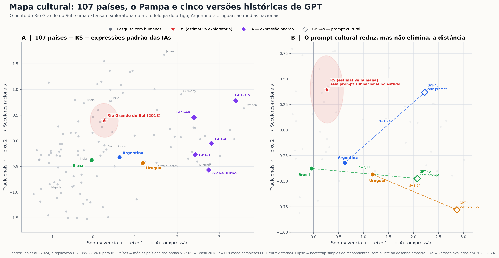

# Nota metodológica — mapa cultural do Pampa e das IAs

## Resultado em uma frase

É possível acrescentar um ponto exploratório para o Rio Grande do Sul ao mapa de Tao et al. (2024): a microbase brasileira do WVS 7 identifica `BR-RS`, e 118 dos 151 entrevistados gaúchos têm respostas válidas nos dez itens necessários. O ponto estimado é **(0,266; 0,398)** — eixo sobrevivência/autoexpressão e eixo tradicional/secular-racional, respectivamente.

## Coordenadas principais

| Entidade | Tipo | Eixo 1: sobrevivência → autoexpressão | Eixo 2: tradicional → secular-racional |
| --- | --- | ---: | ---: |
| Brasil | média nacional do artigo | −0,037 | −0,376 |
| Argentina | média nacional do artigo | 0,628 | −0,320 |
| Uruguai | média nacional do artigo | 1,184 | −0,434 |
| Rio Grande do Sul | estimativa subnacional, WVS 2018 | **0,266** | **0,398** |
| GPT-3 | expressão padrão | 2,428 | −0,269 |
| GPT-3.5 | expressão padrão | 3,393 | 0,780 |
| GPT-4 | expressão padrão | 2,814 | −0,051 |
| GPT-4 Turbo | expressão padrão | 2,752 | −0,568 |
| GPT-4o | expressão padrão | 2,398 | 0,457 |

Para o RS, o intervalo percentil de 95% do bootstrap simples foi **[0,007; 0,536]** no eixo 1 e **[0,137; 0,663]** no eixo 2. A análise de sensibilidade com `W_WEIGHT` produziu **(0,289; 0,424)**, muito próxima da estimativa não ponderada usada para manter compatibilidade com o procedimento do artigo.

## O que o segundo painel acrescenta

Tao et al. também instruíram o GPT-4o a responder como uma pessoa típica de cada país. O prompting cultural deslocou as respostas, mas não as levou até os pontos humanos:

| Identidade no prompt | Ponto humano | GPT-4o com prompt | Distância euclidiana |
| --- | --- | --- | ---: |
| Argentina | (0,628; −0,320) | (2,226; 0,369) | **1,74** |
| Brasil | (−0,037; −0,376) | (2,074; −0,475) | **2,11** |
| Uruguai | (1,184; −0,434) | (2,868; −0,781) | **1,72** |

O estudo não testou prompting subnacional para o Rio Grande do Sul. Por isso, a figura não inventa um “GPT gaúcho”: mostra somente a estimativa humana do estado e registra a lacuna experimental.

## Como o ponto do RS foi calculado

O procedimento reproduz a especificação de [Tao et al. (2024)](https://doi.org/10.1093/pnasnexus/pgae346) e usa seus [materiais de replicação](https://osf.io/7sj3w/):

1. Foram recuperadas as coordenadas dos 107 países e as respostas dos modelos depositadas no OSF.
2. A transformação linear dos dez itens para os dois componentes foi reconstruída a partir das respostas culturalmente condicionadas do GPT-4o e das coordenadas publicadas. O maior resíduo numérico foi `1,98 × 10⁻¹⁴`, isto é, erro de arredondamento de máquina.
3. Na microbase [WVS 7 v6.0](https://www.worldvaluessurvey.org/WVSDocumentationWV7.jsp), selecionaram-se Brasil (`B_COUNTRY=76`) e Rio Grande do Sul (`N_REGION_ISO=76021`; código alternativo `N_REGION_WVS=76058`).
4. Aplicou-se o mesmo tratamento de ausências do artigo: valores não positivos foram excluídos nos nove itens ordinários; em `Y003`, somente valores menores ou iguais a −5 foram excluídos.
5. Como `psych::principal()` foi chamado com `missing=FALSE`, uma pessoa só recebe coordenadas quando possui os dez itens válidos. Restaram 118 casos completos.
6. As coordenadas individuais foram transformadas e então promediadas sem peso, em conformidade com o código dos autores. O peso amostral foi usado apenas como teste de sensibilidade.
7. A incerteza foi estimada por 20 mil reamostragens simples de respondentes, com semente fixa. A elipse é bivariada e baseada na covariância dessas reamostragens.

### Itens e equivalências no WVS 7

| Variável IVS | Variável WVS 7 | Conteúdo |
| --- | --- | --- |
| A008 | Q46 | felicidade |
| A165 | Q57 | confiança interpessoal |
| E018 | Q45 | maior respeito pela autoridade |
| E025 | Q209 | assinatura de petições |
| F063 | Q164 | importância de Deus |
| F118 | Q182 | justificabilidade da homossexualidade |
| F120 | Q184 | justificabilidade do aborto |
| G006 | Q254 | orgulho nacional |
| Y002 | Y002, derivada de Q154–Q155 | índice pós-materialista de quatro itens |
| Y003 | Y003, derivada de Q8, Q14, Q15 e Q17 | índice de autonomia |

A equivalência dos itens está documentada no [relatório conjunto EVS/WVS](https://access.gesis.org/dbk/69548?download_purpose=-99), e o WVS publica também a [sintaxe oficial dos fatores do mapa](https://www.worldvaluessurvey.org/WVSContents.jsp?CMSID=tradrat).

## Limitações que devem acompanhar a figura

1. **O ponto do RS é exploratório.** A amostra brasileira foi desenhada para representatividade nacional; não há garantia de representatividade estadual. O `n=118` também torna a estimativa sensível à composição da subamostra.
2. **As janelas temporais diferem.** Os 107 países são médias de coordenadas país-ano nas ondas 5–7 do IVS; o RS usa apenas a coleta brasileira de 2018.
3. **Argentina e Uruguai são países inteiros.** Eles não equivalem estatisticamente à população do Pampa argentino ou uruguaio. “Pampa” deve ser apresentado como enquadramento regional, não como definição da amostra.
4. **A elipse não é design-based.** Ela ignora estratos, conglomerados e calibração; expressa apenas a instabilidade por reamostragem dos 118 casos completos.
5. **Os pontos de IA são versões históricas.** O estudo avaliou `text-davinci-002`, GPT-3.5-turbo-0613, GPT-4-0613, GPT-4-turbo-2024-04-09 e GPT-4o-2024-05-13. A figura não descreve necessariamente modelos atuais.
6. **O mapa mede respostas a dez perguntas, não uma “essência cultural”.** Ele é um instrumento comparativo útil, mas reduz culturas complexas a dois componentes.
7. **Proveniência para publicação.** A microbase do WVS exige registro gratuito e concordância com condições que proíbem redistribuição. Ela não está incluída no pacote. Antes da publicação, convém baixar a cópia oficial e executar novamente o script; isso evita depender de qualquer cópia intermediária da versão 6.0.

## Redação sugerida para o artigo

> Para testar a possibilidade de uma localização subnacional, estendemos exploratoriamente o procedimento de Tao et al. (2024) à subamostra do Rio Grande do Sul na sétima onda do World Values Survey. Dos 151 respondentes identificados no estado, 118 apresentaram dados válidos nos dez itens usados para compor o mapa de Inglehart–Welzel. O ponto resultante (0,266 no eixo sobrevivência–autoexpressão; 0,398 no eixo tradicional–secular-racional) distingue-se tanto da média brasileira usada no estudo quanto das posições nacionais da Argentina e do Uruguai. A estimativa não deve ser interpretada como retrato representativo da cultura gaúcha: a amostra foi desenhada para inferência nacional, a janela temporal difere da média multinível usada para os países e o próprio mapa reduz repertórios culturais complexos a dois componentes. Seu valor é heurístico: demonstra que uma voz regional pode ocupar posição distinta da média nacional e, portanto, que “alinhamento ao Brasil” não esgota a questão do alinhamento cultural no Pampa.

## Legenda sugerida

> **Figura X. Mapa cultural de 107 países, Rio Grande do Sul e cinco versões históricas de GPT.** As coordenadas nacionais e das IAs reproduzem Tao et al. (2024). O ponto do Rio Grande do Sul é uma extensão exploratória baseada na subamostra brasileira do WVS 7 de 2018 (`n=151`; `n=118` casos completos); a elipse representa um bootstrap simples de respondentes e não incorpora o desenho amostral. O painel B conecta as posições humanas de Argentina, Brasil e Uruguai às respostas do GPT-4o após prompting cultural. Argentina e Uruguai representam médias nacionais, não exclusivamente a população do Pampa. Modelos avaliados entre 2020 e 2024.

## Arquivos

- `figura-mapa-cultural-pampa-ia.png`: versão raster em alta resolução.
- `figura-mapa-cultural-pampa-ia.svg`: versão vetorial editável.
- `figura-mapa-cultural-pampa-ia.pdf`: versão vetorial para publicação.
- `coordenadas-mapa-cultural.csv`: 107 países, RS, cinco IAs padrão e três pontos com prompting cultural.
- `coeficientes-transformacao.csv`: interceptos e coeficientes dos dois eixos.
- `gerar-mapa-cultural.py`: reprodução da figura e recálculo opcional do RS com a microbase oficial.

### Texto alternativo da figura

Figura em dois painéis. À esquerda, 107 países aparecem como pontos cinza em um plano cultural. Argentina, Brasil e Uruguai estão destacados em azul, verde e laranja; o Rio Grande do Sul aparece como estrela vermelha com elipse de incerteza, acima dos três no eixo secular-racional. Cinco versões de GPT aparecem como losangos roxos, todas muito mais à direita, na direção de autoexpressão. À direita, setas tracejadas ligam os pontos humanos de Argentina, Brasil e Uruguai aos pontos produzidos pelo GPT-4o após prompting cultural; as distâncias permanecem entre 1,72 e 2,11. Não há ponto de IA culturalmente condicionado para o Rio Grande do Sul.
